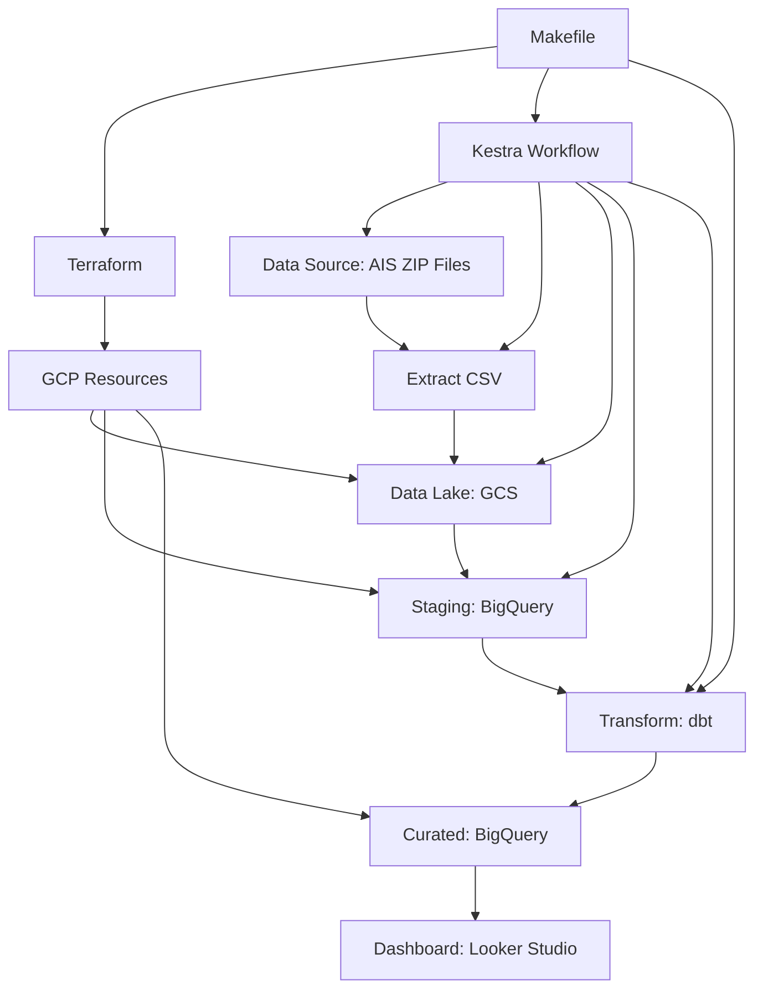

# System Patterns

## System Architecture

## Key Technical Decisions

### 1. Cloud Platform
- **Decision**: Use Google Cloud Platform (GCP) for all cloud resources
- **Rationale**: 
  - Integrated services for storage (GCS), analytics (BigQuery), and visualization (Looker Studio)
  - Strong support for data engineering workloads
  - First-class BigQuery integration with dbt

### 2. Data Lake
- **Decision**: Use Google Cloud Storage (GCS) as the data lake
- **Rationale**:
  - Cost-effective storage for raw data files
  - Native integration with BigQuery for data loading
  - Scalable to accommodate growing data volumes

### 3. Data Warehouse
- **Decision**: Use BigQuery with a staging and curated layer approach
- **Rationale**:
  - Serverless architecture eliminates infrastructure management
  - Separation of concerns with staging (raw) and curated (transformed) data
  - Partitioning and clustering capabilities for query performance

### 4. Transformation Tool
- **Decision**: Use dbt (data build tool) for transformations
- **Rationale**:
  - SQL-based transformations are accessible and maintainable
  - Support for testing, documentation, and version control
  - Modular approach with staging and curated models

### 5. Orchestration
- **Decision**: Use Kestra for pipeline orchestration
- **Rationale**:
  - Declarative YAML-based workflow definition
  - Strong built-in integration with cloud services
  - Simpler configuration and maintenance compared to Airflow
  - Powerful templating and error handling capabilities

### 6. Infrastructure as Code
- **Decision**: Use Terraform for infrastructure provisioning
- **Rationale**:
  - Declarative approach to resource definition
  - State management for tracking deployed resources
  - Support for multiple environments and providers

### 7. Reproducibility
- **Decision**: Use Makefile for environment setup and command execution
- **Rationale**:
  - Standardized interface for common operations
  - Reduced complexity for setup and deployment
  - Documentation of key commands and workflows

## Design Patterns

### 1. Extract-Load-Transform (ELT)
- Load raw data into staging tables before transformation
- Leverage BigQuery's processing power for transformations
- Maintain data lineage from source to curated tables

### 2. Data Layering
- **Raw Layer**: Original files in GCS
- **Staging Layer**: Raw data loaded into BigQuery
- **Curated Layer**: Transformed, cleaned data ready for analysis
- **Mart Layer**: Aggregated data optimized for specific dashboard use cases

### 3. Pipeline Orchestration
- Task-based workflow definition
- Idempotent task execution
- Clear separation of extraction, loading, and transformation tasks
- Proper error handling and recovery mechanisms

### 4. Infrastructure as Code
- Declarative resource definitions
- Version-controlled infrastructure
- Reproducible environment setup

## Component Relationships

### Data Source to Data Lake
- Monthly AIS ZIP files are downloaded and extracted
- CSV files are uploaded to GCS bucket
- Raw data is preserved in its original form

### Data Lake to Data Warehouse
- CSV files are loaded from GCS to BigQuery staging tables
- Schema is applied during loading process
- Data types are validated and enforced

### Staging to Curated Layer
- dbt models transform staging data into analytical models
- Data cleaning, normalization, and enrichment are performed
- Partitioning and clustering optimize query performance

### Curated to Mart Layer
- Further aggregation and transformation for specific use cases
- Pre-computed metrics for dashboard performance
- Optimized for specific visualization requirements

### Mart Layer to Dashboard
- Looker Studio connects directly to BigQuery mart tables
- Visualizations are created based on pre-aggregated data
- Dashboard provides interactive exploration capabilities

### Orchestration and Infrastructure
- Kestra orchestrates the entire data flow
- Terraform provisions all required cloud resources
- Makefile provides a unified interface for common tasks

This document outlines the key architectural decisions, design patterns, and component relationships for the AIS data engineering project. It serves as a guide for understanding the system's structure and the rationale behind technical choices.
